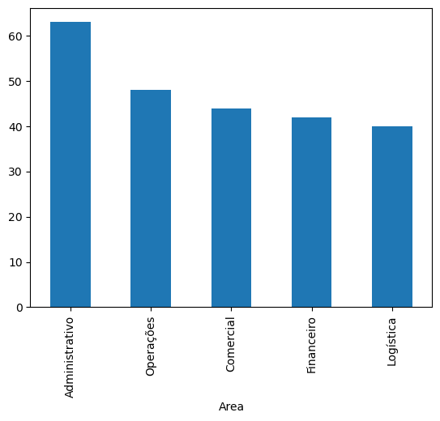

# Análise de Dados da Empresa

Este projeto realiza uma análise de dados para uma empresa, utilizando informações sobre serviços prestados, clientes e funcionários. A análise inclui cálculos da folha salarial, faturamento, percentual de funcionários que fecharam contratos, total de contratos e funcionários por área, e o ticket médio mensal, projeto realizado durante meu curso de python na hashtag treinamentos.

## Importação de Módulos e Arquivos

Para começar, importamos as bibliotecas necessárias e os arquivos que contêm os dados relevantes da empresa.

```
import pandas as pd
import matplotlib.pyplot as plt

servicos = pd.read_excel(r"BaseServiçosPrestados.xlsx")
clientes = pd.read_csv(r"CadastroClientes.csv", sep=';', decimal=',')
funcionarios = pd.read_csv(r"CadastroFuncionarios.csv", sep=';', decimal=',')
```
Em seguida, calculamos a folha salarial total da empresa. Para isso, somamos o salário base, os impostos, os benefícios, o vale-transporte (VT) e o vale-refeição (VR) de todos os funcionários.

```
folha = funcionarios['Salario Base'] + funcionarios['Impostos'] + funcionarios['Beneficios'] + funcionarios['VT'] + funcionarios['VR']
print("A folha salarial foi de: R${:,} ".format(folha.sum()))
A folha salarial foi de: R$2,717,493.22 
```
Após isso, calculamos o faturamento total da empresa. Isso é feito multiplicando o tempo total de contrato dos clientes pelo valor do contrato mensal.
```
fat = servicos[['ID Cliente', 'Tempo Total de Contrato (Meses)']].merge(clientes[['ID Cliente', 'Valor Contrato Mensal']], on='ID Cliente')
fat_emp = fat['Tempo Total de Contrato (Meses)'] * fat['Valor Contrato Mensal']
print("O faturamento total da empresa foi de: R${:,} ".format(fat_emp.sum()))
A folha salarial foi de: R$5,519,160 
```
Em seguida, analisamos a porcentagem de funcionários que fecharam contratos. Para isso, calculamos a quantidade total de funcionários e a quantidade de funcionários que estão associados a serviços prestados.

```
qtdt= len(funcionarios['ID Funcionário'])
qtdf= len(servicos['ID Funcionário'].unique()) 
p= qtdf/qtdt
print("A quantidade de funcionários que fechou contrato foi de: {:.2%} ".format(p))
A quantidade de funcionários que fechou contrato foi de: 86.84% 
```
Por último, visualizamos os dados de contratos e funcionários por área. Primeiro, obtemos o total de contratos por área e o exibimos em um gráfico de barras.
```
ca = servicos[['ID Funcionário']].merge(funcionarios[['ID Funcionário', 'Area']], on='ID Funcionário')
tca = ca['Area'].value_counts()
print(tca)
tca.plot(kind='bar')
plt.show()
```
!Total de Funcionários por Área.png](imagens/Total de Funcionários por Área.png.png)

Depois, obtemos o total de funcionários por área e também exibimos em um gráfico de barras.
```
tfa = funcionarios['Area'].value_counts()
print(tfa)
tfa.plot(kind='bar')
plt.show()
```


Além disso, calculamos o ticket médio mensal dos clientes. Essa métrica é importante para entender o valor médio gasto por cliente na empresa.
```
tm = clientes['Valor Contrato Mensal'].mean()
print("O Ticket Médio Mensal foi de: R${:,.2f} ".format(tm))
O Ticket Médio Mensal foi de: R$2,502.56 
```


